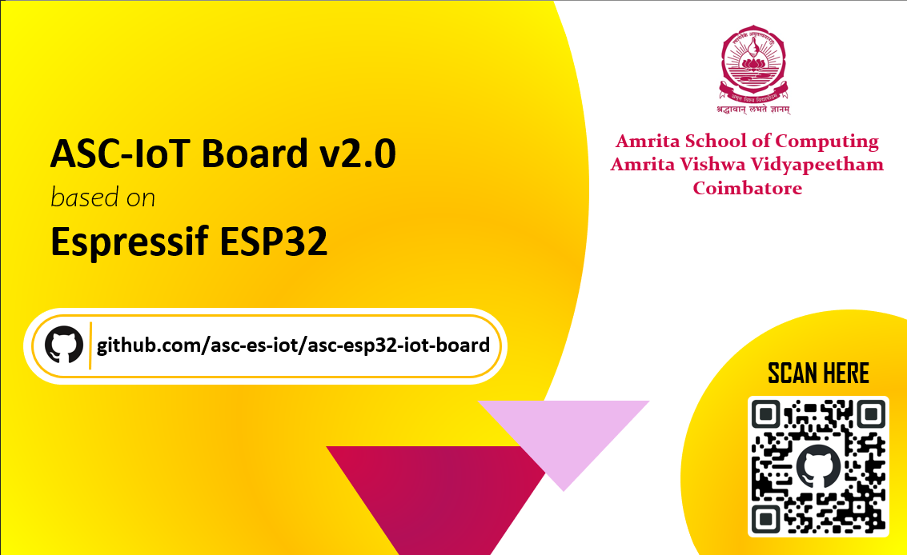

<h1 align="center">ESP32 IoT Board </h1>

A tutorial repository for the IoT end device board - **ESP32** developed by 
students and faculty from Amrita School of Computing, **Amrita Vishwa Vidyapeetham**, Coimbatore.

## Table of Contents
1. [Introduction](#introduction)
2. [About the Board](#about-the-board)
3. [Setup](#setup-arduino-ide)
4. [List of Modules](#list-of-modules)
5. [References](#references)
6. [Contribution Guidelines](#contribution-guidelines)

## Introduction

The ASC CSE IoT 2.0 board is the second in the series of boards released by Amrita School of Computing, Amrita Vishwa Vidyapeetham, Coimbatore.
It is an all in one kit to get you started on embedded systems development.

### About the Board

The ASC CSE IoT 2.0 comes with built-in WiFi and Bluetooth capabilities. It is based on the Espressif ESP32-WROOM Series.
It can be connected to a PC via a USB Type - C connector for power, programming and serial communication.
The board also contains
- 2 Programmable LEDs
- 1 LDR
- 1 Potentiometer
- 1 Programmable Switch

The board has custom made connectors for various commonly used sensors and modules:
- 3-Axis Gyroscope and AccelerometerMPU6050
- CAN Transceiver TJA105
- USB2UART FT232 Module
- 8 MB SPI based Data Flash module W25Q64

This enables simple plug-and-play use.

Other modules using the same protocols will need to be connected to these interfaces using jumper wires if their pinouts don't match the connectors on the board.

## Getting Started

To begin learning about the ASC CSE IoT 2.0 (ESP32) complete the setup by refering to the [setup-docs](SETUP.md). Post setup, head over to the [`basics/blink`](basics/blink) directory to get started.

## List of Modules

The following modules are a part of the repository - 

| Module | Description|
| --------- | ------------ |
| [**basics**](basics/) | Sample code and explanations covering the basics of working with the ASC CSE IoT 2.0, and embedded devices in general.  |
| [**sensors**](sensors/) | Sample code and explanations to work with various sensors.  |
| [**wireless**](wireless/) | Sample code and explanation for working with the board's built-in WiFi and Bluetooth LE |
| [**docs**](docs) | Complete documentation of the board. |
| [**assets**]() | Contains all screenshots embedded in the tutorial documentation. |

A reference to all the acronyms used during this tutorial can be found [here](./docs/Interfaces.md). 

## References

The following code snippets were obtained from the **examples for ESP32 boards** in the ESP32 support package by Espressif Systems for Arduino IDE:
For further exploration, refer this [link](#).
<!-- List of important links to be added towards the end.-->

## Contribution Guidelines
To contribute to the project, refer [CONTRIBUTING](CONTRIBUTING.md).

## Credits

All tutorials, code examples and testing work have been done by the following students :
* [Aadithyaa E](https://github.com/aadit-n3rdy)
* [Jeet Thakur](https://github.com/Jeet-Thakur)
* [Srivatsan Sriram](https://github.com/srivatssriram)
* [Ananthakrishnan Balajee](https://github.com/ananthakrishna7)
* [Ritesh Koushik](https://github.com/IAmRiteshKoushik)

Under the guidance of our mentor:  
**Dr. V Ananthanarayanan**   
Associate Professor -School of Computing  
**Amrita Vishwa Vidyapeetham, Coimbatore**
  
