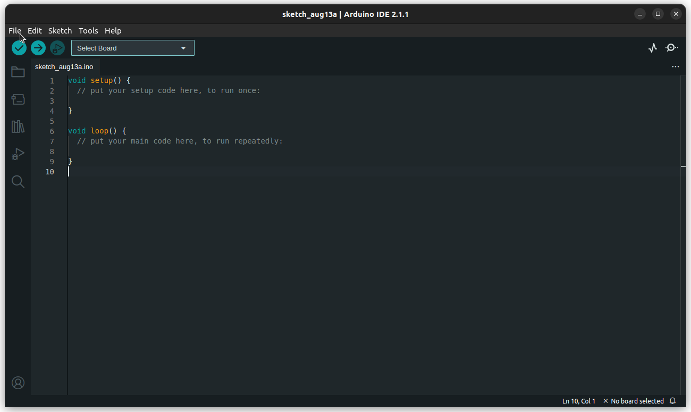
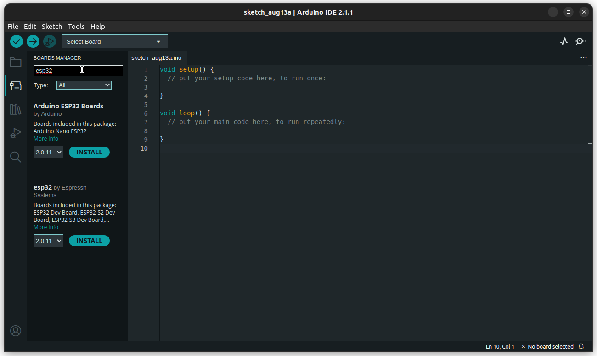
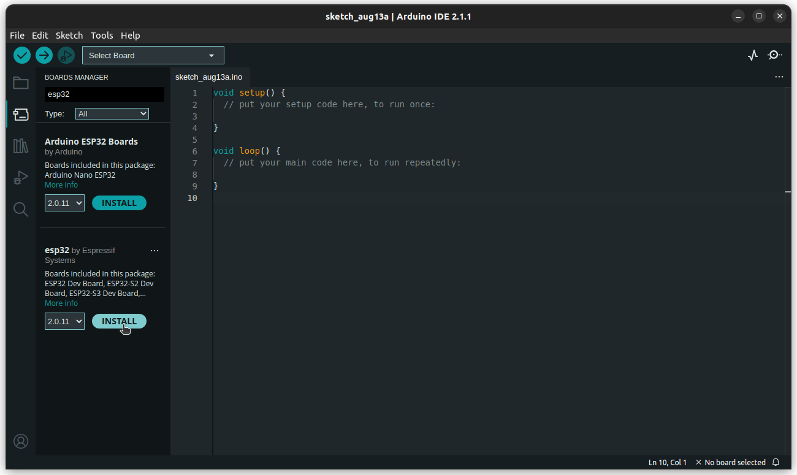
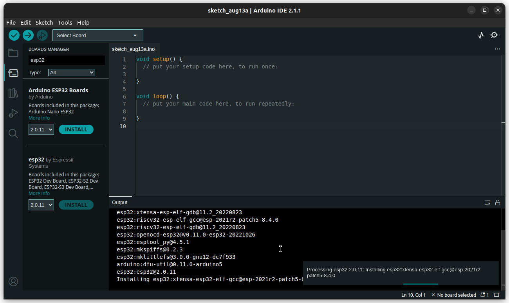

<center><h1> ASC ESP32 IoT Board </h1></center>

A GitHub Repository for the IoT end device board for the ESP32, developed by 
students from Amrita School of Computing, Amrita Vishwa Vidyapeetham, Coimbatore.

## Table of Contents

## Introduction


The ASC CSE IoT 2.0 board is the second in the series of boards released by Amrita School of Computing, Amrita Vishwa Vidyapeetham, Coimbatore.
It is an all in one kit to get you started on embedded systems development.

### The Board

The ASC CSE IoT 2.0 comes with built-in WiFi and Bluetooth capabilities. It is based on the Espressif ESP32-WROOM Series.
It can be connected to a PC via a USB Type - C connector for power, programming and serial communication.
The board also houses
- 2 Programmable LEDs
- 1 LDR
- 1 Potentiometer
- 1 Programmable Switch

The board has custom made connectors for various commonly used sensors and modules:
- 3-Axis Gyroscope and AccelerometerMPU6050
- CAN Transceiver TJA105
- USB2UART FT232 Module
- 8 MB SPI based Data Flash module W25Q64

This enables simple plug-and-play use.

Other modules using the same protocols will need to be connected to these interfaces using jumper wires if their pinouts don't match the connectors on the board.


## Setup Arduino IDE

Download the [Arduino IDE](https://www.arduino.cc/en/software) if you haven't done so already.

1. Open the Arduino IDE. 
2. Click File > Preferences... 
3. Paste this URL in the "Additional boards manager URLs":
	```https://raw.githubusercontent.com/espressif/arduino-esp32/gh-pages/package_esp32_index.json```
	
	
4. Click OK.

The required libraries should start downloading automatically (you will be notified). If not, do this:
1. Click on Tools > Boards > Boards Manager...
2. Search for "esp32" . 
3. Install "esp32 by Espressif Systems" 
4. Verify that the installation starts. 

Once the installation is complete, you can write code for your board.

Head over to the `basics/blink` folder to get started with programming on the ASC CSE IoT 2.0

## List of Modules

| Module | Description|
| --------- | ------------ |
| **basics** | Sample code and explanations covering the basics of working with the ASC CSE IoT 2.0, and embedded devices in general.  |
| **sensors** | Sample code and explanations to work with various sensors.  |
| **wireless** | Sample code and explanation for working with the board's built-in WiFi and Bluetooth LE |
| **docs** | Complete documentation of the board. |


## References

The following code snippets were obtained from the examples for ESP32 boards in the ESP32 support package by Espressif Systems for Arduino IDE:
- 


## Contribution Guidelines
To contribute to the project, refer [CONTRIBUTING](CONTRIBUTING.md).
