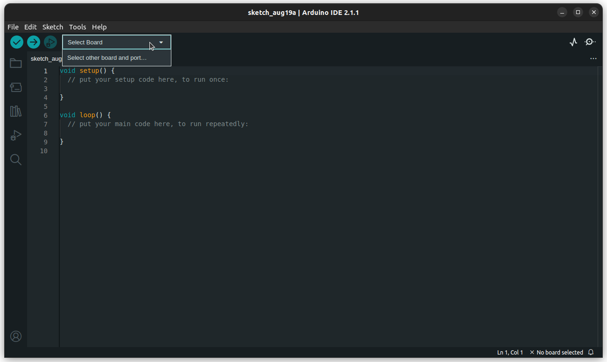
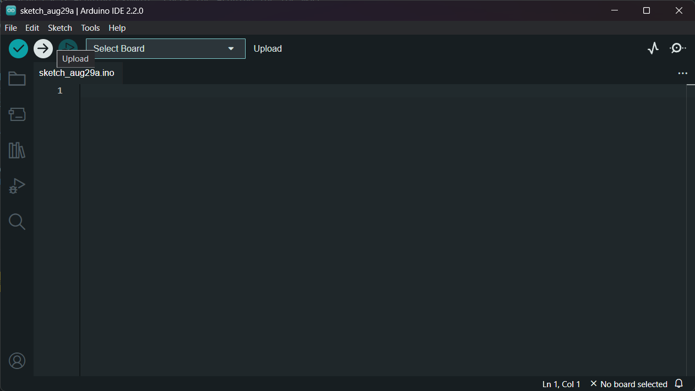

# Connecting your board to your PC

We assume that you have the necessary drivers installed for connecting your board to your PC. If not, a simple Google search will give ypu what you need for your OS.

To connect your board to the Arduino IDE,

1. Click on **Select Board** > **Select other board and port...**.
	

1. Select your board and port and click **OK**.

Now that your board is connected to the Arduino IDE, head over to [led_blink](led_blink/README.md) to get started.

# Additional Notes

## Flashing code onto the board

To flash your code onto your board, click the arrow icon next to the tick icon on the toolbar at the top.

