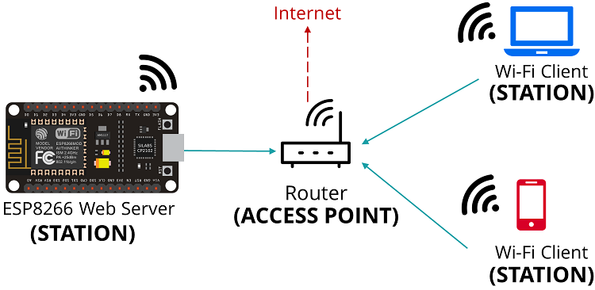

# Wi-Fi Library

Start by including the `Wifi.h` header file into your code to use the ESP32 Wi-Fi 
functionalities is to include 

```c
#include<Wifi.h>
```

## ESP32 Wifi Modes :
The ESP32 board can act as Wi-Fi Station, Access Point or both. To set the Wi-Fi mode, use `Wifi.mode()` and set the desired mode as argument :

- `WiFi.mode(WIFI_STA)` **:** Station Mode - the ESP32 connects to an Access Point
- `Wifi.mode(WIFI_AP)` **:** Access Point Mode - stations can connect to the ESP32
- `Wifi.mode(EIFI_AP_STA)` **:** Access point and a station connected to another access point

## Wi-Fi Station

Wi-Fi Station **(WiFi-STA)** mode tries to connect to your home/office network using its access piont router paramters **(SSID and password)**. In this scenario, the router assigns a unique IP address to your ESP board. You can communicate with the ESP32 using other devices (stations) that are also connected to the same network by referring to the ESP32 unique IP address. 


In the picture above, the device shown is labelled as ESP8266 but the setup remains the same for ESP32. 

1. Set the ESP32 as a **station** and connect to the WiFi network. 
2. Go to **Connect to Wifi Network** to learn how to set the ESP32 as station and connect it to a network.

> **Warning**  
In some cases, this might not be the best configuration when you do not have a network nearby and want to still connect to the ESP32 to control it. In this scenario, you must set up you ESP32 board as an **access point.**

## Access Point
An access point is a device the creates a wireless Local Area Newtork (WLAN) is usually in an office or large building. An Access Point connects to a wired router, switch of hub via Ethernet cables, and projects a Wi-Fi signal to a designated area. 

When you set your ESP32 board as an Access Point, you can be connected using any device with Wi-Fi capabilities without connecting to your router. When you set the ESP32 access point, you create its own Wi-Fi network, and nearby Wi-Fi devices (stations) can connect to it, i.e smartphone or PC. 

> **Note**  
You do not need a router to control it. 

> **Note**  
The ESP32 does not connect further to a Wired Network like a router, hence it is called as a soft-AP (soft Access Point). If you try to load libraries or use firmware from the internet, it will not work. 

## Wi-Fi Setup

This includes the network SSID and passwd to connect Wifi. 
Refer source file in [documentation]().
<!-- Yet to locate source file in documentation for linking-->

```c
const char* ssid = ""; // enter your network SSID
const char* password = ""; // enter your network passwd
int led = 2;  // onboard LED
```

## Setup Instructions

**Step 01:** Select the appropriate board and port where the board is to be connected.  
**Step 02:** Upload the code in ESP32  
**Step 03:** After upload, open the Serial Monitor and press ESP32 on-board RST button.  
<blockquote>It will connect to your network and print the network IP Address of the ESP32, enter the IP Address in your web browser. </blockquote>  

**Step 04:** You will be able to remote control the LED through the Web Server.   
