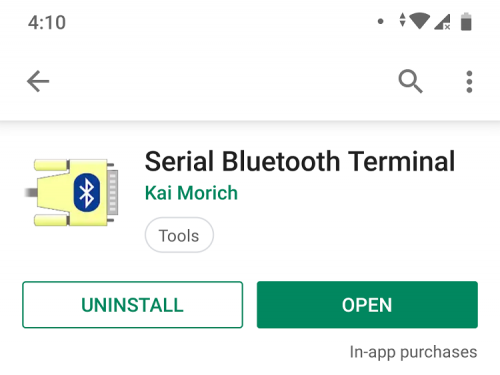
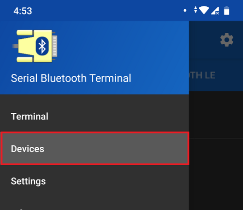
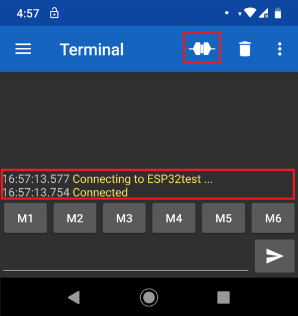
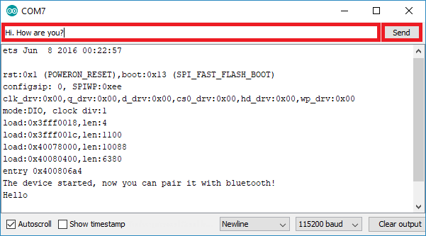
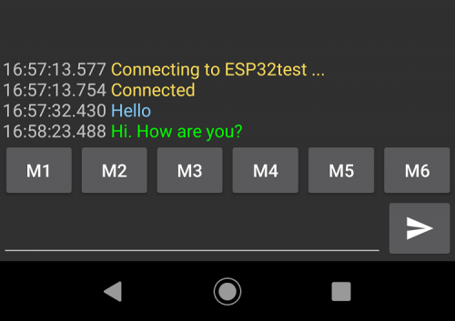

# Bluetooth terminal application

To proceed with this tutorial, you need a Bluetooth Terminal application installed on your smartphone. In this example, we have used the "Serial Bluetooth Terminal" app.



## HOW THIS CODE WORKS

This code establishes a two-way serial Bluetooth communication between two devices.
> **Note:**  
The code starts by including the BluetoothSerial library.

the next 3 lines checks if the bluetooth property is enabled:
```c
	#if !defined(CONFIG_BT_ENABLED) || !defined(CONFIG_BLUEDROID_ENABLED)
	#error Bluetooth is not enabled! Please run `make menuconfig` to and enable it
	#endif
```
Then, an instance of BluetoothSerial called SerialBT is created:  
```
	BluetoothSerial SerialBT;
```

In the ```setup()```, initialize a serial communication at a baud rate of 115200:

```c
    Serial.begin(115200);
```

Initialize the Bluetooth serial device and pass as an argument the Bluetooth Device name. By default, it’s called ESP32test, but you can rename it and give it a unique name:
```c
	SerialBT.begin("ESP32test"); //Bluetooth device name
```
In the ```loop()```, send and receive data via Bluetooth Serial.

In the first if statement, we check if there are bytes being received in the serial port. If there are, send that information via Bluetooth to the connected device.

```c
	if (Serial.available()) {
	SerialBT.write(Serial.read());
	}
```
```SerialBT.write()``` sends data using bluetooth serial.

```Serial.read()``` returns the data received in the serial port.

The next if statement checks if there are bytes available to read in the Bluetooth Serial port. If there are, we’ll write those bytes in the Serial Monitor:

```c
	if (SerialBT.available()) {
	Serial.write(SerialBT.read());
	}
```
## INSTRUCTIONS
* Upload the code to the ESP32. Make sure you have the right board and COM port selected.

* After uploading the code, open the Serial Monitor at a baud rate of 115200. Press the ESP32 Enable button.


* After a few seconds, you should get a message saying: “The device started, now you can pair it with bluetooth!”.

* Go to your smartphone and open the “Serial Bluetooth Terminal” app. Make sure you’ve enable your smartphone’s Bluetooth.



* To connect to the ESP32 for the first time, you need to pair a new device.

* After pairing, you should get a “Connected” message.



* After that, type something in the Serial Bluetooth Terminal app. For example, “Hello”.


* You should instantly receive that message in the Arduino IDE Serial Monitor.


* You can also exchange data between your Serial Monitor and your smartphone. Type something in the Serial Monitor top bar and press the “Send” button.



* You should instantly receive that message in the Serial Bluetooth Terminal App.

